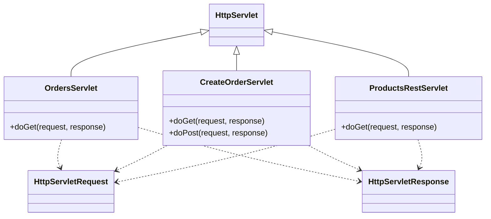

# Лабораторная работа №5

## Тема

Разработка Web-приложения для магазина зоотоваров с использованием Java Servlet и Apache Tomcat 11.

## Описание работы

В ходе лабораторной работы был создан Web-проект, который собирается в WAR-файл и разворачивается на сервере Apache Tomcat 11.

В приложении реализованы:

- страница со списком заказов;
- форма создания заказа;
- переход после создания заказа обратно к списку;
- REST-сервис для получения информации о продуктах.

## Использованные технологии

- Java 17
- Gradle
- WAR
- Jakarta Servlet API
- Apache Tomcat 11
- Postman

## Адреса приложения

Список заказов:

```text
http://localhost:8080/petshop/orders
```

Форма создания заказа:

```text
http://localhost:8080/petshop/orders/create
```

REST-сервис продуктов:

```text
http://localhost:8080/petshop/api/products
```

## Сборка проекта

Для сборки WAR-файла использовалась команда:

```bash
gradle war
```

После сборки WAR-файл был размещён в директории `webapps` сервера Apache Tomcat 11.

## REST-сервис

REST-сервис возвращает список продуктов в формате JSON. Для каждого продукта выводятся:

- название продукта;
- название категории;
- количество на складе.

Пример ответа:

```json
[
  {
    "name": "Корм для попугая",
    "category": "Корма",
    "stockQuantity": 25
  },
  {
    "name": "Игрушка для кота",
    "category": "Игрушки",
    "stockQuantity": 14
  },
  {
    "name": "Аквариум",
    "category": "Аквариумистика",
    "stockQuantity": 7
  }
]
```

## UML-диаграмма классов



## Вывод

В результате выполнения лабораторной работы было создано простое Web-приложение для магазина зоотоваров. Приложение успешно собирается в WAR-файл, разворачивается на Apache Tomcat 11 и обрабатывает HTTP-запросы через Java-сервлеты.